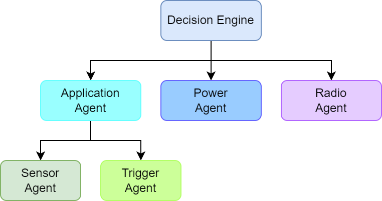

# Self-Aware Sensor Node Architecture
Reference architecture of a self-aware sensor node.

This module contains a basic implementation of the proposed self-aware sensor node architecture.
For more information on this architecture, check:

* [Arnaiz, David, et al. "Data Relevance-Aware Dynamic Sensing Technique with Battery Lifetime Guarantee for Wireless Sensor Nodes." 2021 XXXVI Conference on Design of Circuits and Integrated Systems (DCIS). IEEE, 2021.](https://ieeexplore.ieee.org/abstract/document/9666191)
* [Arnaiz, David, et al. "Energy and relevance-aware adaptive monitoring method for wireless sensor nodes with hard energy constraints." Integration (2023): 102097.](https://www.sciencedirect.com/science/article/pii/S0167926023001396)

This architecture implements a different agent that manages the different parts of the sensor node (sampling agent, processing agent, power agent, radio agent); the decision engine, which collects the information of the different agents and selects the appropriate adaptive actions.



## Usage
Some tests implementing partial functionality can be seen run.

Navigate to the make directory:
```
cd firmware/make
```

Get help for the makefile:
```
make help
```

List available tests:
```
make list_test
```

Run power agent test:

```
make RUN=true TEST=POWER
```

## Note
This program is distributed in the hope that it will be useful, but WITHOUT
ANY WARRANTY; without even the implied warranty of MERCHANTABILITY or FITNESS
FOR A PARTICULAR PURPOSE.